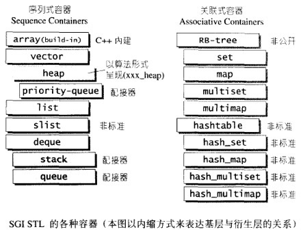
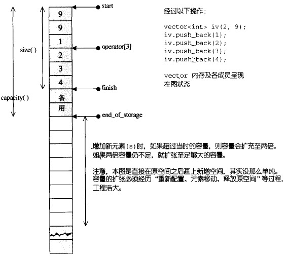

* [一.简介](#一简介)
    * [1.GNU源代码开发精神](#1gnu源代码开放精神)
    * [2.STL版本](#2stl版本)
    * [3.SGI STL头文件分布](#3sgi-stl头文件分布)
    * [4.STL六大部件](#4stl六大部件)
* [二.空间分配器](#二空间分配器)
    * [1.空间分配器的标准接口](#1空间分配器的标准接口)
    * [2.SGI标准的空间分配器std::allocator](#2sgi标准的空间分配器stdallocator)
    * [3.SGI特殊的空间分配器std::alloc](#3sgi特殊的空间分配器stdalloc)
        - [3.1 对象构造与析构](#31-对象构造与析构)
        - [3.2 内存分配与释放](#32-内存分配与释放)
            + [1）两级分配器](#1两级分配器)
            + [2）第一级分配器__malloc_alloc_template](#2第一级分配器__malloc_alloc_template)
            + [3）第二级分配器__default_alloc_template](#3第二级分配器__default_alloc_template)
        - [3.3 内存基本处理工具](#33-内存基本处理工具)
* [三.迭代器与traits编程技法](#三迭代器与traits编程技法)
    - [1.迭代器相应类型](#1迭代器相应类型)
    - [2.traits编程技法](#2traits编程技法)
    - [3.std::iterator的保证](#3stditerator的保证)
    - [4.SGI STL的__type_traits](#4sgi-stl的__type_traits)
* [四.顺序容器](#四顺序容器)
    - [1.vector](#1vector)
    - [2.list](#2list)
    - [3.deque](#3deque)
    - [4.stack](#4stack)
    - [5.queue](#5queue)
    - [6.heap](#6heap)
    - [7.priority_queue](#7priority_queue)
    - [8.slist](#8slist)
* [五.关联容器](#五关联容器)
    - [1.RB-tree](#1rb-tree)
    - [2.set](#2set)
    - [3.map](#3map)
    - [4.multiset](#4multiset)
    - [5.multimap](#5multimap)
    - [6.hashtable](#6hashtable)
    - [7.hash_set](#7hash_set)
    - [8.hash_map](#8hash_map)
    - [9.hash_multiset](#9hash_multiset)
    - [10.hash_multimap](#10hash_multimap)
* [六.算法](#六算法)
    - [1.区间拷贝](#1区间拷贝)
    - [2.set相关算法](#2set相关算法)
    - [3.排序sort](#3排序sort)
    - [4.其它算法](#4其它算法)
* [七.仿函数](#七仿函数)
    - [1.仿函数的相应类型](#1仿函数的相应类型)
    - [2.算术类仿函数](#2算术类仿函数)
    - [3.关系运算类仿函数](#3关系运算类仿函数)
    - [4.逻辑运算类仿函数](#4逻辑运算类仿函数)
    - [5.证同，选择与投射](#5证同选择与投射)
* [八.适配器](#八适配器)
    - [1.容器适配器](#1容器适配器)
    - [2.迭代器适配器](#2迭代器适配器)
        + [2.1 insert iterators](#21-insert-iterators)
        + [2.2 reverse iterators](#22-reverse-iterators)
        + [2.3 iostream iterators](#23-iostream-iterators)
    - [3.函数适配器](#3函数适配器)
        + [3.1 not1和not2](#31-not1和not2)
        + [3.2 bind1st和bind2st](#32-bind1st和bind2st)
        + [3.3 compose1和compose2](#33-compose1和compose2)
        + [3.4 用于函数指针的ptr_fun](#34-用于函数指针的ptr_fun)
        + [3.5 用于成员函数指针的mem_fun和mem_fun_ref](#35-用于成员函数指针的mem_fun和mem_fun_ref)

<br>
<br>
<br>

# 四.顺序容器

<div align="center">  </div>

上图中的“衍生”并非“派生”，而是内含关系。例如heap内含一个vector，priority-queue内含一个heap，stack和queue含一个deque，set/map/multiset/multimap都含一个RB-tree，has_x含一个hashtable

## 1. vector

array是静态空间，一旦配置了就不能改变；vector与array非常相似，但是vector是动态空间，随着元素加入，内部机制会自动扩充以容纳新元素

SGI STL中[vector的定义](tass-sgi-stl-2.91.57-source/stl_vector.h#L12)

<div align="center">  </div>

### 1.1 迭代器

vector维护的是一个连续线性空间，所以无论其元素类型为何，普通指针都可以作为vector的迭代器而满足所有必要条件，因为vector迭代器所需要的操作行为，如
operator\*，operator->，operator++，operator--，operator+，operator-，operator+=，operator-=，普通指针天生就具备。
vector支持随机存取，而普通指针正有着这样的能力。所以，vector提供的是Random Access Iterators：

```
template <class T,class Alloc = alloc>
class vector{
public:
    typedef T               value_type;
    typedef value_type*     iterator;   //vector的迭代器时普通指针
...
};
```

### 1.2 分配器

vector缺省使用alloc作为空间分配器，并据此另外定义了一个data_allocator，为的是更方便以元素大小为配置单位：

```
template<class T,class Alloc = alloc>
class vector{
protected:
    typedef simple_alloc<value_type,Alloc> data_allocator;
...
};
```

因此，data_allocator::allocate(n)表示分配n个元素空间

### 1.3 vector操作的实现

常见的vector操作包括：

* [vector(size_type n,const T &value)](tass-sgi-stl-2.91.57-source/stl_vector.h#L98)
    - [fill_initialize(size_type n,const T &value)](tass-sgi-stl-2.91.57-source/stl_vector.h#L98)
        + [allocate_and_fill(size_type n, const T& x)](tass-sgi-stl-2.91.57-source/stl_vector.h#L213)
* [push_back(const T &x)](tass-sgi-stl-2.91.57-source/stl_vector.h#L144)
    - [insert_aux(iterator position,const T &x)](tass-sgi-stl-2.91.57-source/stl_vector.h#L323)
* [pop_back()](tass-sgi-stl-2.91.57-source/stl_vector.h#L186)
* [erase(iterator first, iterator last)](tass-sgi-stl-2.91.57-source/stl_vector.h#L197)
* [erase(iterator position)](tass-sgi-stl-2.91.57-source/stl_vector.h#L190)
* [insert(iterator position, size_type n, const T& x)](tass-sgi-stl-2.91.57-source/stl_vector.h#L361)

**插入操作可能造成vector的3个指针重新配置，导致原有的迭代器全部失效**
