* [一.简介](#一简介)
    * [1.GNU源代码开发精神](#1gnu源代码开放精神)
    * [2.STL版本](#2stl版本)
    * [3.SGI STL头文件分布](#3sgi-stl头文件分布)
    * [4.STL六大部件](#4stl六大部件)
* [二.空间分配器](#二空间分配器)
    * [1.空间分配器的标准接口](#1空间分配器的标准接口)
    * [2.SGI标准的空间分配器std::allocator](#2sgi标准的空间分配器stdallocator)
    * [3.SGI特殊的空间分配器std::alloc](#3sgi特殊的空间分配器stdalloc)
        - [3.1 对象构造与析构](#31-对象构造与析构)
        - [3.2 内存分配与释放](#32-内存分配与释放)
            + [1）两级分配器](#1两级分配器)
            + [2）第一级分配器__malloc_alloc_template](#2第一级分配器__malloc_alloc_template)
            + [3）第二级分配器__default_alloc_template](#3第二级分配器__default_alloc_template)
        - [3.3 内存基本处理工具](#33-内存基本处理工具)
* [三.迭代器与traits编程技法](#三迭代器与traits编程技法)
    - [1.迭代器相应类型](#1迭代器相应类型)
    - [2.traits编程技法](#2traits编程技法)
    - [3.std::iterator的保证](#3stditerator的保证)
    - [4.SGI STL的__type_traits](#4sgi-stl的__type_traits)
* [四.顺序容器](#四顺序容器)
    - [1.vector](#1vector)
    - [2.list](#2list)
    - [3.deque](#3deque)
    - [4.stack](#4stack)
    - [5.queue](#5queue)
    - [6.heap](#6heap)
    - [7.priority_queue](#7priority_queue)
    - [8.slist](#8slist)
* [五.关联容器](#五关联容器)
    - [1.RB-tree](#1rb-tree)
    - [2.set](#2set)
    - [3.map](#3map)
    - [4.multiset](#4multiset)
    - [5.multimap](#5multimap)
    - [6.hashtable](#6hashtable)
    - [7.hash_set](#7hash_set)
    - [8.hash_map](#8hash_map)
    - [9.hash_multiset](#9hash_multiset)
    - [10.hash_multimap](#10hash_multimap)
* [六.算法](#六算法)
    - [1.区间拷贝](#1区间拷贝)
    - [2.set相关算法](#2set相关算法)
    - [3.排序sort](#3排序sort)
    - [4.其它算法](#4其它算法)
* [七.仿函数](#七仿函数)
    - [1.仿函数的相应类型](#1仿函数的相应类型)
    - [2.算术类仿函数](#2算术类仿函数)
    - [3.关系运算类仿函数](#3关系运算类仿函数)
    - [4.逻辑运算类仿函数](#4逻辑运算类仿函数)
    - [5.证同，选择与投射](#5证同选择与投射)
* [八.适配器](#八适配器)
    - [1.容器适配器](#1容器适配器)
    - [2.迭代器适配器](#2迭代器适配器)
        + [2.1 insert iterators](#21-insert-iterators)
        + [2.2 reverse iterators](#22-reverse-iterators)
        + [2.3 iostream iterators](#23-iostream-iterators)
    - [3.函数适配器](#3函数适配器)
        + [3.1 not1和not2](#31-not1和not2)
        + [3.2 bind1st和bind2st](#32-bind1st和bind2st)
        + [3.3 compose1和compose2](#33-compose1和compose2)
        + [3.4 用于函数指针的ptr_fun](#34-用于函数指针的ptr_fun)
        + [3.5 用于成员函数指针的mem_fun和mem_fun_ref](#35-用于成员函数指针的mem_fun和mem_fun_ref)

<br>
<br>
<br>

# 二.空间分配器

在运用层面，不需要关心空间分配器。但是在容器背后，空间分配器负责容器中元素空间的分配

不称做“内存分配器”，是因为分配的空间不一定是内存，可以是磁盘或其它辅助存储介质。可以实现一个获取磁盘空间的allocator。不过这里介绍的空间分配器获取的空间是内存

## 1.空间分配器的标准接口

通常，C++内存分配和释放的操作如下：

```c++
class Foo {...};
Foo *pf = new Foo;
delete pf;
```

* **new内含2阶段操作**：
    - 调用::operator new分配内存
  - 调用构造函数构造对象
* **delete也含2阶段操作**：
  - 调用析构函数析构对象
  - 调用::operator delete释放内存

STL allocator将new和delete的2阶段操作进行了分离：

* 内存分配：由alloc::allocate()负责
* 内存释放：由alloc::deallocate()负责
* 对象构造：由alloc::construct()负责
* 对象析构：由alloc::destroy负责

根据**STL的规范**，以下是allocator的必要接口：

```c++
allocator::value_type
allocator::pointer
allocator::const_pointer
allocator::reference
allocator::const_reference
allocator::size_type
allocator::difference_type

//一个嵌套的class template，class rebind<U> 拥有唯一成员other,是一个typedef，代表allocator<U>
allocator::rebind

//构造函数
allocator::allocator()
//拷贝构造函数
allocator::allocator(const allocator&)
template <class U> allocator::allocator(const allocator<U>&)
//析构函数
allocator::~allocator

//返回某个对象的地址，等同于&x
pointer allocator::address(reference x) const
const_pointer allocator::address(const_reference x) const

//分配空间，足以容纳n个元素
pointer allocator::allocate(size_type n,const void* = 0)
//归还之前分配的空间
void allocator::deallocate(pointer p,size_type n)
//可分配的最大空间
size_type allocator::max_size() const

//通过x，在p指向的地址构造一个对象。相当于new((void*)p) T(x)
void allocator::construct(pointer p,const T& x)
//析构地址p的对象
void allocator::destroy(pointer p)
```

* **只能有限度搭配PJ STL**，因为PJ STL未完全遵循STL规格，其所供应的许多容器都需要一个非标准的空间分配器接口
* **只能有限度地搭配RW STL**，因为RW STL在很多容器身上运用了缓冲区，情况复杂很多
* **完全无法应用于SGI STL**，因为SGI STL在这个项目上根本就脱离了STL标准规格，使用一个专属的、拥有次层配置能力的、效率优越的特殊分配器。但提供了一个对其进行了封装的名为simple_alloc的分配器，符合部分标准

## 2.SGI标准的空间分配器std::allocator

虽然SGI也定义有一个**符合”部分“标准**、名为[allocator](tass-sgi-stl-2.91.57-source/defalloc.h)的分配器，但SGI自己从未用过它，也**不建议我们使用**。**主要原因是效率不佳**，只把C++的::operator new和::operator delete做一层薄薄的包装而已

## 3.SGI特殊的空间分配器std::alloc

STL标准规定分配器定义于```<memory>```中，SGI```<memory>```内含两个文件，负责分离的2阶段操作

<div align="center"> 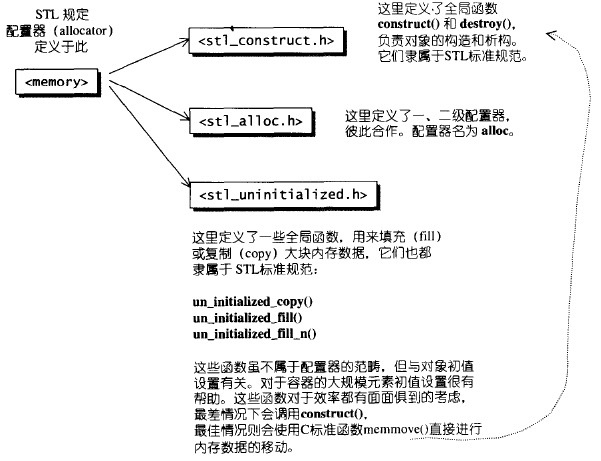 </div>

> 真正在SGI STL中大显身手的分配器（即SGI特殊的空间分配器std::alloc）或为第一级分配器，或为第二级分配器

### 3.1 对象构造与析构

[<stl_construct.h>](tass-sgi-stl-2.91.57-source/stl_construct.h)

<div align="center"> 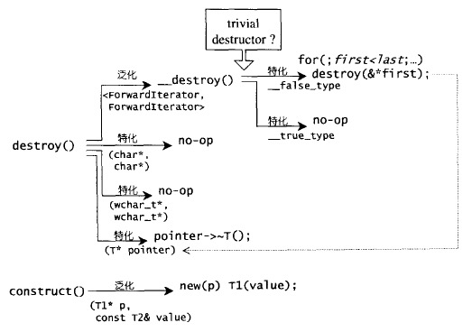 </div>

> STL规定分配器必须拥有名为construct()和destroy()的两个成员函数，然而SGI特殊的空间分配器std::alloc并未遵守这一规则，所以实际上这部分属于STL allocator，但不属于std::alloc。换句话说，SGI特殊的空间分配器std::alloc不包含”3.1 对象构造与析构“，只包含”3.2 内存分配与释放“

### 3.2 内存分配与释放

SGI对内存分配与释放的设计哲学如下：

* 向system heap申请空间
* 考虑多线程状态
* 考虑内存不足时的应变措施
* 考虑过多“小型区块”可能造成的内存碎片问题（**SGI设计了双层级分配器**）

**C++的内存分配基本操作是::operator new(),内存释放基本操作是::operator delete()。这两个全局函数相当于C的malloc()和free()函数。SGI正是以malloc和free()完成内存的分配与释放**

#### 1）两级分配器

考虑到小型区块所可能造成的内存碎片问题，SGI设计了双层级分配器：

<div align="center"> 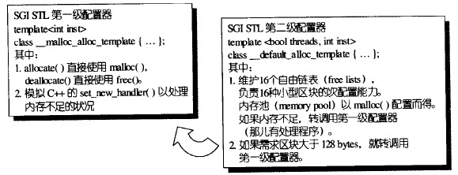 </div>

* 第一级分配器
  - 直接使用malloc()和free()
* 第二级分配器
  - 当分配区块超过128bytes时，视为“足够大”，调用第一级分配器
  - 当分配区块小于128bytes时，视为“过小”，为了降低额外负担，采用复杂的memory pool整理方式，不再求助于第一级分配器

无论alloc被定义为第一级或第二级分配器，SGI还为它再包装一个接口，使分配器的接口能够符合STL规格：

```c++
template<class T, class Alloc>
class simple_alloc {

public:
  static T *allocate(size_t n)
              { return 0 == n? 0 : (T*) Alloc::allocate(n * sizeof (T)); }
  static T *allocate(void)
              { return (T*) Alloc::allocate(sizeof (T)); }
  static void deallocate(T *p, size_t n)
              { if (0 != n) Alloc::deallocate(p, n * sizeof (T)); }
  static void deallocate(T *p)
              { Alloc::deallocate(p, sizeof (T)); }
};
```

内部4个函数都是转调用分配器的成员函数。**这个接口使分配器的分配单位从bytes转为个别元素的大小**

<div align="center"> 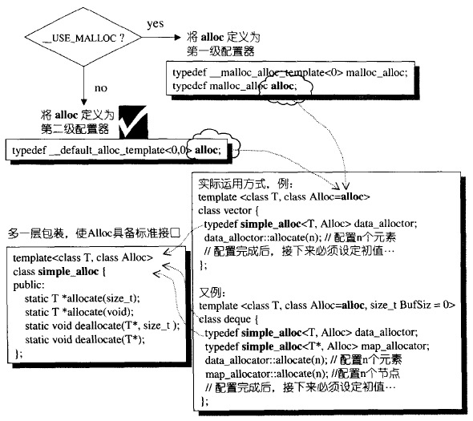 </div>

> 上图中Alloc=alloc中的缺省alloc可以是第一级分配器，也可以是第二级分配器。SGI STL已经把它设为第二级分配器

两级分配器都定义在头文件[<stl_alloc.h>](tass-sgi-stl-2.91.57-source/stl_alloc.h)中

#### 2）第一级分配器__malloc_alloc_template

```c++
//一般而言是线程安全，并且对于空间的运用比较高效
//无“template型别参数”，至于”非型别参数“inst，则完全没派上用场
template <int inst>
class __malloc_alloc_template {

private:
//oom：out of memory ，用来处理内存不足的情况
static void *oom_malloc(size_t);

static void *oom_realloc(void *, size_t);

#ifndef __STL_STATIC_TEMPLATE_MEMBER_BUG
  static void (* __malloc_alloc_oom_handler)();
#endif

public:

static void * allocate(size_t n)
{
  void *result = malloc(n);//第一级分配器直接使用malloc()
  //以下无法满足需求时，改用oom_malloc()
  if (0 == result) result = oom_malloc(n);
  return result;
}

static void deallocate(void *p, size_t /* n */)
{
  free(p);//第一级分配器直接使用free()
}

static void * reallocate(void *p, size_t /* old_sz */, size_t new_sz)
{
  void * result = realloc(p, new_sz);//第一级分配器直接使用realloc()
  //以下无法满足需求时，改用oom_realloc()
  if (0 == result) result = oom_realloc(p, new_sz);
  return result;
}

//以下仿真C++的set_new_handler()。可以通过它指定自己的
//out-of-memory handler
//不能直接运用C++ new-handler机制，因为它并非使用::operator new来分配内存
static void (* set_malloc_handler(void (*f)()))()
{
  void (* old)() = __malloc_alloc_oom_handler;
  __malloc_alloc_oom_handler = f;
  return(old);
}

};

// malloc_alloc out-of-memory handling

#ifndef __STL_STATIC_TEMPLATE_MEMBER_BUG
//初值为0，有待客户设定
template <int inst>
void (* __malloc_alloc_template<inst>::__malloc_alloc_oom_handler)() = 0;
#endif

template <int inst>
void * __malloc_alloc_template<inst>::oom_malloc(size_t n)
{
  void (* my_malloc_handler)();
  void *result;

  for (;;) {//不断尝试释放、分配、再释放、再分配...
      my_malloc_handler = __malloc_alloc_oom_handler;
      if (0 == my_malloc_handler) { __THROW_BAD_ALLOC; }
      (*my_malloc_handler)(); //调用处理例程，企图释放内存
      result = malloc(n);     //再次尝试分配内存
      if (result) return(result);
  }
}

template <int inst>
void * __malloc_alloc_template<inst>::oom_realloc(void *p, size_t n)
{
  void (* my_malloc_handler)();
  void *result;

  for (;;) {//不断尝试释放、分配、再释放、再分配...
      my_malloc_handler = __malloc_alloc_oom_handler;
      if (0 == my_malloc_handler) { __THROW_BAD_ALLOC; }
      (*my_malloc_handler)(); //调用处理例程，企图释放内存
      result = realloc(p, n); //再次尝试分配内存
      if (result) return(result);
  }
}
```

* 以malloc()、free()、realloc()等C函数执行实际的内存分配、释放、重分配操作
* 实现出类似C++ new-handler的机制（**C++ new-handler机制是，可以要求系统在内存分配需求无法被满足时，调用一个你所指定的函数。换句话说，一旦::operator new无法完成任务，在丢出std::bad_alloc异常状态之前，会先调用由客户指定的处理例程，该处理例程通常即被称为new-handler**），不能直接运用C++ new-handler机制，因为它并非使用::operator new来分配内存（[operator new的实现](C++对象模型.md#3operator-new和operator-delete的实现)）

#### 3）第二级分配器__default_alloc_template

第二级分配器多了一些机制，避免太多小额区块造成内存的碎片，小额区块存在下列问题：

* 产生内存碎片
* 额外负担。额外负担是一些区块信息，用以管理内存。区块越小，额外负担所占的比例就越大，越显浪费

<div align="center"> 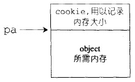 </div>

* 当区块大于128bytes时，视为大区块
  - 转交第一级分配器处理
* 当区块小于128bytes时，视为小额区块
  - 以**内存池管理(也称为次层分配)**：每次分配一大块内存，并维护对应的自由链表(free-list)，下次若载有相同大小的内存需求，就直接从free-list中拨出。如果客户释放小额区块，就由分配器回收到free-list中。**维护有16个free-list**，各自管理大小分别为8，16，24，32，40，48，56，64，72，80，88，96，104，112，120，128bytes的小额区块
  - SGI第二级分配器会主动将任何小额区块的内存需求量上调至8的倍数

free-list使用如下结构表示：

```c++
//使用union解决free-list带来的额外负担：维护链表所必须的指针而造成内存的另一种浪费
union obj{
  union obj * free_list_link; //系统视角
  char client_data[1];        //用户视角
}
```

下图是free-list的实现技巧：

<div align="center"> 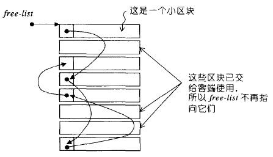 </div>

第二级分配器__default_alloc_template也定义在头文件[<stl_alloc.h>](tass-sgi-stl-2.91.57-source/stl_alloc.h)中，以下为部分实现：

```c++
#ifdef __SUNPRO_CC
// breaks if we make these template class members:
enum {__ALIGN = 8};                           //小型区块的上调边界
enum {__MAX_BYTES = 128};                     //小型区块的上限
enum {__NFREELISTS = __MAX_BYTES/__ALIGN};    //free-list的个数
#endif

//第二级分配器的定义
//无”template型别参数“，第一个参数用于多线程环境，第二参数完全没派上用场
template <bool threads, int inst>
class __default_alloc_template {

private:
  //将bytes上调至8的倍数
  static size_t ROUND_UP(size_t bytes) {
      return (((bytes) + __ALIGN-1) & ~(__ALIGN - 1));
  }
private:
  //free-list
  union obj {
      union obj * free_list_link;
      char client_data[1];    /* The client sees this.        */
  };
private:
  //16个free-list
  static obj * volatile free_list[__NFREELISTS];
  //根据区块大小，决定使用第n号free-list。n从0算起
  static  size_t FREELIST_INDEX(size_t bytes) {
      return (((bytes) + __ALIGN-1)/__ALIGN - 1);
  }

  //返回一个大小为n的对象，并可能加入大小为n的其它区块到free-list
  static void *refill(size_t n);
  //分配一大块空间，可容纳nobjs个大小为”size“的区块
  //如果分配nobjs个区块有所不便，nobjs可能会降低
  static char *chunk_alloc(size_t size, int &nobjs);

  // Chunk allocation state.
  static char *start_free;  //内存池起始位置。只在chunk_alloc()中变化
  static char *end_free;    //内存池结束位置。只在chunk_alloc()中变化
  static size_t heap_size;

public:
  static void * allocate(size_t n){ /*详述于后*/ }
  static void deallocate(void *p, size_t n){ /*详述于后*/ }
  static void * reallocate(void *p, size_t old_sz, size_t new_sz);
};

/*以下是static data member的定义与初始值*/

template <bool threads, int inst>
char *__default_alloc_template<threads, inst>::start_free = 0;

template <bool threads, int inst>
char *__default_alloc_template<threads, inst>::end_free = 0;

template <bool threads, int inst>
size_t __default_alloc_template<threads, inst>::heap_size = 0;

template <bool threads, int inst>
__default_alloc_template<threads, inst>::obj * volatile
__default_alloc_template<threads, inst> ::free_list[__NFREELISTS] =
  {0, 0, 0, 0, 0, 0, 0, 0, 0, 0, 0, 0, 0, 0, 0, 0, };
```

* 空间分配函数[allocate()](tass-sgi-stl-2.91.57-source/stl_alloc.h#L403)
  - 若区块大于128bytes，就调用第一级分配器
  - 若区块小于128bytes，检查对应的free-list
      + 若free-list之内有可用的区块，则直接使用
      + 若free-list之内没有可用区块，将区块大小调至8倍数边界，调用refill()，准备为free-list重新填充空间

<div align="center"> 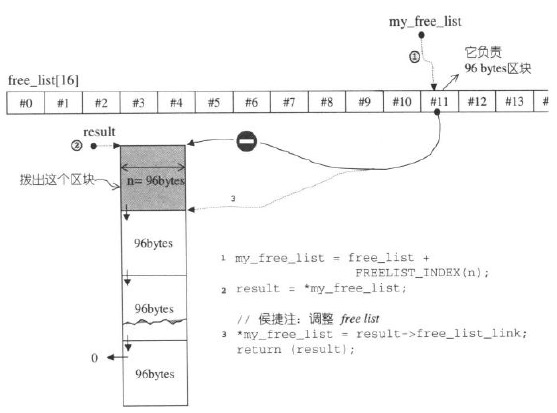 </div>

* 空间释放函数[deallocate()](tass-sgi-stl-2.91.57-source/stl_alloc.h#L433)
   - 若区块大于128bytes，就调用第一级分配器
   - 若区块小于128bytes，找出对应的free-list，将区块回收

<div align="center"> 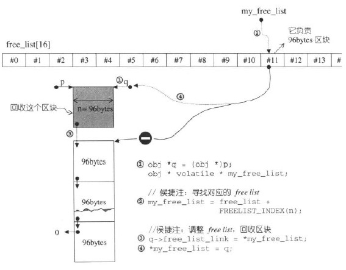 </div>

* 重新填充free-list的函数[refill()](tass-sgi-stl-2.91.57-source/stl_alloc.h#L537)
  - 若free-list中没有可用区块时，会调用chunk_alloc**从内存池**中申请空间重新填充free-list。缺省申请20个新节点(新区块)，如果内存池空间不足，获得的节点数可能小于20

* [chunk_alloc()](tass-sgi-stl-2.91.57-source/stl_alloc.h#L465)函数从内存池申请空间，根据end_free-start_free判断内存池中剩余的空间
  - 如果剩余空间充足
      + 直接调出20个区块返回给free-list
  - 如果剩余空间不足以提供20个区块，但足够供应至少1个区块
      + 拨出这不足20个区块的空间
  - 如果剩余空间连一个区块都无法供应
      + 利用malloc()从heap中分配内存（大小为需求量的2倍，加上一个随着分配次数增加而越来越大的附加量），为内存池注入新的可用空间（**详细例子见下图**）
      + 如果malloc()获取失败，chunk_alloc()就四处寻找有无”尚有未用且区块足够大“的free-list。找到了就挖出一块交出
      + 如果上一步仍未成功，那么就调用第一级分配器，第一级分配器有out-of-memory处理机制，或许有机会释放其它的内存拿来此处使用。如果可以，就成功，否则抛出bad_alloc异常

  <div align="center"> 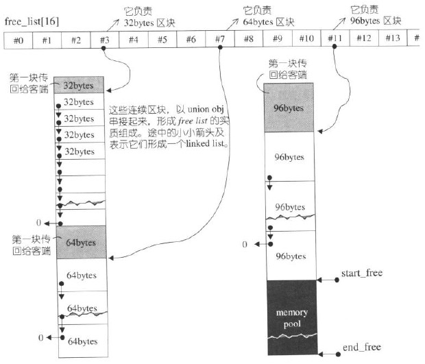 </div>

  上图中，一开始就调用chunk_alloc(32,20)，于是malloc()分配40个32bytes区块，其中第1个交出，另19个交给free-list[3]维护，余20个留给内存池；接下来客户调用chunk_alloc(64,20)，此时free_list[7]空空如也，必须向内存池申请。内存池只能供应(32\*20)/64=10个64bytes区块，就把这10个区块返回，第1个交给客户，余9个由free_list[7]维护。此时内存池全空。接下来再调用chunk_alloc(96,20)，此时free-list[11]空空如也，必须向内存池申请。而内存池此时也为空，于是以malloc()分配40+n(附加量)个96bytes区块，其中第1个交出，另19个交给free-list[11]维护，余20+n(附加量)个区块留给内存池...

### 3.3 内存基本处理工具

STL定义了5个全局函数，作用于未初始化空间上，有助于容器的实现：

* 作用于单个对象（见[3.1 对象构造与析构](#31-对象构造与析构)，SGI STL定义在头文件[<stl_construct.h>](tass-sgi-stl-2.91.57-source/stl_construct.h)中）
  - construct()函数（构造单个对象）
  - destroy()函数（析构单个对象）
* 作用于容器的区间（本节，SGI STL定义在头文件[<stl_uninitialized.h>](tass-sgi-stl-2.91.57-source/stl_uninitialized.h)中，是高层copy()、fill()、fill_n()的底层函数）
  - [uninitialized_copy()](tass-sgi-stl-2.91.57-source/stl_uninitialized.h#L76)函数
  - [uninitialized_fill()](tass-sgi-stl-2.91.57-source/stl_uninitialized.h#L171)函数
  - [uninitialized_fill_n()](tass-sgi-stl-2.91.57-source/stl_uninitialized.h#L218)函数

容器的全区间构造函数通常分2步：

1. 分配内存区块，足以包含范围内的所有元素
2. 调用上述3个函数在全区间范围内构造对象（因此，这3个函数使我们能够将内存的分配与对象的构造行为分离；并且3个函数都具有”commit or rollback“语意，要么所有对象都构造成功，要么一个都没有构造）

<div align="center"> 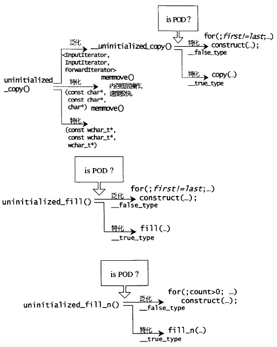 </div>

<br>

# 三.迭代器与traits编程技法

在算法中运用迭代器时，很可能会用到其相应类型。所谓相应类型，迭代器所指之物的类型便是其中之一，算法可以在函数体中使用迭代器所指之物的类型来定义变量，也可能将迭代器所指之物的类型作为算法的返回值：

<div align="center"> 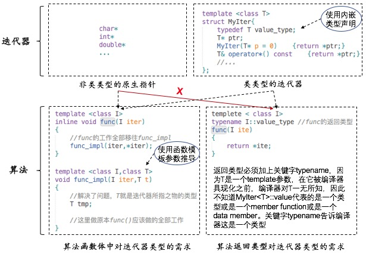 </div>

* **在函数体中使用迭代器所指之物的类型**
    - C++支持sizeof()，但并未支持typeof。即便动用RTTI性质中的typeid()，获得的也只是类型名称，不能拿来做变量声明
    - 这里利用函数模板的参数推导机制解决。算法func()作为对外接口，算法的所有逻辑另外封装在一个实现函数func_impl()中，由于它是一个函数模板，一旦被调用，编译器就会自动进行参数推导，导出类型T
* **迭代器所指之物的类型作为算法的返回类型**
    - 函数模板的参数推导机制推导的是参数，无法推导函数的返回类型
    - 这里使用嵌套类型声明解决。但是，对于类类型的迭代器，可以正常工作，但是**非类类型的原生指针无法处理**

通过上图，可以了解到在算法中对迭代器相应类型的需求。除了迭代器所指之物的类型(value type)，迭代器相应类型还包括另外4种，在traits编程技法中将会介绍，并且会提到如何使用traits来解决上面的问题（这也是STL中实际使用的方法）

## 2.traits编程技法

上一节所使用的方法，在value type作为返回类型时，无法处理非类类型的原生指针。下图使用traits来解决，使用了模板偏特化来处理非类类型的原生指针：

<div align="center"> 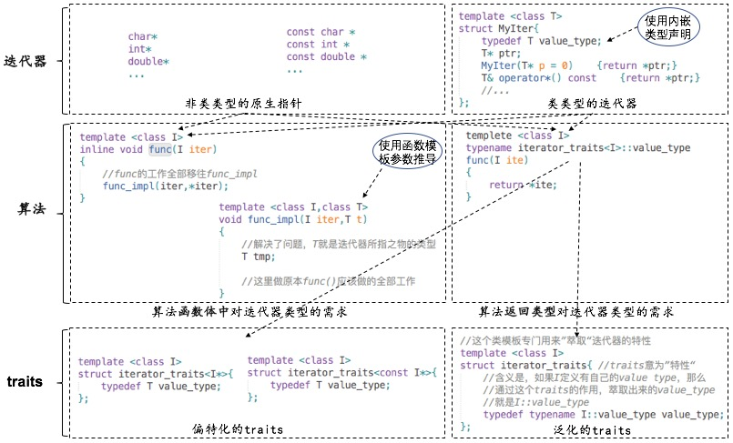 </div>

<br>

现在，不论面对的是迭代器MyIter，或是原生指针int\*或const int\*，都可以通过traits取出正确的value type

<div align="center"> 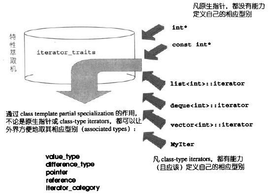 </div>

> 当然，若要“特性萃取机”traits能够有效运作，每一个迭代器必须遵循约定，自行以内嵌类型定义的方式定义出相应类型。这是一个约定，谁不遵守这个约定，谁就不能兼容于STL这个大家庭

**根据经验，最常用到的迭代器相应类型有5种**：

1. **value type**：指迭代器所指对象的类型
2. **difference type**：用以表示两个迭代器之间的距离
3. **pointer**：如果value type是T，那么pointer就是指向T的指针
4. **reference**：如果value type是T，那么reference就是T的引用
5. **iterator category**：迭代器的类型（[详见](#21-迭代器类型)）

    <div align="center"> 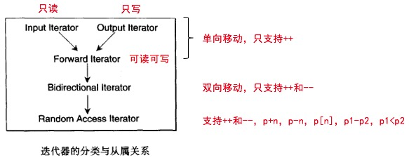 </div>

如果希望开发的容器能与STL相容，一定要为容器定义这5种相应类型。“特性萃取机”traits会很忠实地将特性萃取出来：

```c++
template <class Iterator>
struct iterator_traits{
    typedef typename Iterator::iterator_category   iterator_category;
    typedef typename Iterator::value_type          value_type;
    typedef typename Iterator::difference_type     difference_type;
    typedef typename Iterator::pointer             pointer;
    typedef typename Iterator::reference           reference;
};
```

iterator_traits必须针对传入的类型为pointer及pointer-to-const者设计偏特化版本：

```c++
//以C++内建的ptrdiff_t（定义于<cstddef>头文件）作为原生指针的difference type

//针对原生指针的偏特化版本
template <class T>
struct iterator_traits<T*>{
    //原生指针是一种Random Access Iterator
    typedef random_access_iterator_tag   iterator_category;
    typedef T                            value_type;
    typedef ptrdiff_t                    difference_type;
    typedef T*                           pointer;
    typedef T&                           reference;
};

//针对原生pointer-to-const的偏特化版本
template <class T>
struct iterator_traits<const T*>{
    //原生指针是一种Random Access Iterator
    typedef random_access_iterator_tag   iterator_category;
    typedef T                            value_type;
    typedef ptrdiff_t                    difference_type;
    typedef const T*                     pointer;
    typedef const T&                     reference;
};
```

STL提供以下函数，简化迭代器相应类型的萃取：

```c++
//这个函数可以很方便地萃取category
template <class Iterator>
inline typename iterator_traits<Iterator>::iterator_category
iterator_category(const Iterator&) {
  typedef typename iterator_traits<Iterator>::iterator_category category;
  return category();
}

//这个函数可以很方便地萃取distance type
template <class Iterator>
inline typename iterator_traits<Iterator>::difference_type*
distance_type(const Iterator&) {
  return static_cast<typename iterator_traits<Iterator>::difference_type*>(0);
}

//这个函数可以很方便地萃取value type
template <class Iterator>
inline typename iterator_traits<Iterator>::value_type*
value_type(const Iterator&) {
  return static_cast<typename iterator_traits<Iterator>::value_type*>(0);
}
```


# 四.顺序容器

<div align="center">  </div>

上图中的“衍生”并非“派生”，而是内含关系。例如heap内含一个vector，priority-queue内含一个heap，stack和queue含一个deque，set/map/multiset/multimap都含一个RB-tree，has_x含一个hashtable

## 1. vector

array是静态空间，一旦配置了就不能改变；vector与array非常相似，但是vector是动态空间，随着元素加入，内部机制会自动扩充以容纳新元素

SGI STL中[vector的定义](tass-sgi-stl-2.91.57-source/stl_vector.h#L12)

<div align="center">  </div>

### 1.1 迭代器

vector维护的是一个连续线性空间，所以无论其元素类型为何，普通指针都可以作为vector的迭代器而满足所有必要条件，因为vector迭代器所需要的操作行为，如
operator\*，operator->，operator++，operator--，operator+，operator-，operator+=，operator-=，普通指针天生就具备。
vector支持随机存取，而普通指针正有着这样的能力。所以，vector提供的是Random Access Iterators：

```
template <class T,class Alloc = alloc>
class vector{
public:
    typedef T               value_type;
    typedef value_type*     iterator;   //vector的迭代器时普通指针
...
};
```

### 1.2 分配器

vector缺省使用alloc作为空间分配器，并据此另外定义了一个data_allocator，为的是更方便以元素大小为配置单位：

```
template<class T,class Alloc = alloc>
class vector{
protected:
    typedef simple_alloc<value_type,Alloc> data_allocator;
...
};
```

因此，data_allocator::allocate(n)表示分配n个元素空间


### 1.3 vector操作的实现

常见的vector操作包括：

* [vector(size_type n,const T &value)](tass-sgi-stl-2.91.57-source/stl_vector.h#L98)
    - [fill_initialize(size_type n,const T &value)](tass-sgi-stl-2.91.57-source/stl_vector.h#L98)
        + [allocate_and_fill(size_type n, const T& x)](tass-sgi-stl-2.91.57-source/stl_vector.h#L213)
* [push_back(const T &x)](tass-sgi-stl-2.91.57-source/stl_vector.h#L144)
    - [insert_aux(iterator position,const T &x)](tass-sgi-stl-2.91.57-source/stl_vector.h#L323)
* [pop_back()](tass-sgi-stl-2.91.57-source/stl_vector.h#L186)
* [erase(iterator first, iterator last)](tass-sgi-stl-2.91.57-source/stl_vector.h#L197)
* [erase(iterator position)](tass-sgi-stl-2.91.57-source/stl_vector.h#L190)
* [insert(iterator position, size_type n, const T& x)](tass-sgi-stl-2.91.57-source/stl_vector.h#L361)

**插入操作可能造成vector的3个指针重新配置，导致原有的迭代器全部失效**

### 2.3 list的数据结构

SGI list不仅是一个双向链表，还是一个环状双向链表。所以它只需要一个指针，便可完整表现整个链表：

```
```c++
template <class T, class Alloc = alloc>
class list {
protected:
    typedef __list_node<T> list_node;
public:
    typedef list_node* link_type;

protected:
    link_type node; //只要一个指针，便可表示整个环状双向链表
};

iterator begin() { return (link_type)((*node).next); }
iterator end() { return node; }
size_type size() const {
    size_type result = 0;
    distance(begin(), end(), result);
    return result;
}
```

<div align="center"> 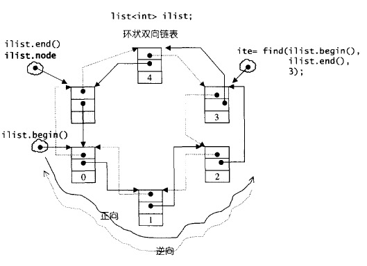 </div>

### 3.3 deque的数据结构

deque采用一块所谓的map作为**主控（中控器）**。这里所谓的map是指一小块连续空间，其中每个元素都是一个指针，指向另一段（较大的）连续线性空间，称为缓冲区。


### 1.2 RB-tree的迭代器

SGI将RB-tree迭代器实现为两层：

<div align="center"> 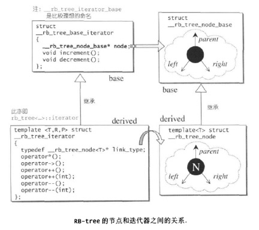 </div>

RB-tree迭代器属于双向迭代器，但不具备随机定位能力。前进操作operator++()调用了基类迭代器的increment()，后退操作operator--()调用了基类迭代器的decrement()。前进或后退的举止行为完全依据二叉搜索树的节点排列法则

```
struct __rb_tree_base_iterator
{
  typedef __rb_tree_node_base::base_ptr base_ptr;
  typedef bidirectional_iterator_tag iterator_category;
  typedef ptrdiff_t difference_type;

  base_ptr node;    //节点基类类型的指针，将迭代器连接到RB-tree的节点

  void increment()
  {
    if (node->right != 0) {//如果node右子树不为空，则找到右子树的最左子节点
      node = node->right;
      while (node->left != 0)
        node = node->left;
    }
    else {//如果node右子树为空，则找到第一个“该节点位于其左子树”的节点
      base_ptr y = node->parent;
      while (node == y->right) {
        node = y;
        y = y->parent;
      }
      if (node->right != y)
        node = y;
    }
  }

  void decrement()
  {
    if (node->color == __rb_tree_red &&
        node->parent->parent == node)//这种情况发生于node为header时（亦即node为
      node = node->right;            //end()时）header右子节点即mostright，指向max节点
    else if (node->left != 0) {//如果左子树不为空，则找到左子树的最右子节点
      base_ptr y = node->left;
      while (y->right != 0)
        y = y->right;
      node = y;
    }
    else {//如果左子树为空，则找到第一个“该节点位于其右子树”的节点
      base_ptr y = node->parent;
      while (node == y->left) {
        node = y;
        y = y->parent;
      }
      node = y;
    }
  }
};

//迭代器类
template <class Value, class Ref, class Ptr>
struct __rb_tree_iterator : public __rb_tree_base_iterator
{
  typedef Value value_type;
  typedef Ref reference;
  typedef Ptr pointer;
  typedef __rb_tree_iterator<Value, Value&, Value*>             iterator;
  typedef __rb_tree_iterator<Value, const Value&, const Value*> const_iterator;
  typedef __rb_tree_iterator<Value, Ref, Ptr>                   self;
  typedef __rb_tree_node<Value>* link_type; //指向RB-tree节点的指针类型

  __rb_tree_iterator() {}
  __rb_tree_iterator(link_type x) { node = x; }
  __rb_tree_iterator(const iterator& it) { node = it.node; }

  //解引用操作为获取所指RB-tree节点的value
  reference operator*() const { return link_type(node)->value_field; }
#ifndef __SGI_STL_NO_ARROW_OPERATOR
  pointer operator->() const { return &(operator*()); }
#endif /* __SGI_STL_NO_ARROW_OPERATOR */

  //调用父类的increment()，函数会修改node成员，使其指向后一个RB-tree节点
  self& operator++() { increment(); return *this; }
  self operator++(int) {
    self tmp = *this;
    increment();
    return tmp;
  }

  //调用父类的decrement()，函数会修改node成员，使其指向前一个RB-tree节点
  self& operator--() { decrement(); return *this; }
  self operator--(int) {
    self tmp = *this;
    decrement();
    return tmp;
  }
};
```

### 1.3 RB-tree操作的实现

SGI STL中[RB-tree的定义](tass-sgi-stl-2.91.57-source/stl_tree.h#L428)

* **节点操作**：
    - 涉及内存管理的操作
        + 分配节点：[get_node](tass-sgi-stl-2.91.57-source/stl_tree.h#L447)
        + 释放节点：[put_node](tass-sgi-stl-2.91.57-source/stl_tree.h#L449)
        + 创建节点：[create_node](tass-sgi-stl-2.91.57-source/stl_tree.h#L452)
        + 拷贝节点：[clone_node](tass-sgi-stl-2.91.57-source/stl_tree.h#L462)
        + 销毁节点：[destroy_node](tass-sgi-stl-2.91.57-source/stl_tree.h#L471)
    - [获取节点成员](tass-sgi-stl-2.91.57-source/stl_tree.h#L489)：
        + left
        + right
        + parent
        + value
        + key
        + color
* **RB-tree操作**
    - 创建空RB-tree：[rb_tree](tass-sgi-stl-2.91.57-source/stl_tree.h#L542)
        + 初始化：[init](tass-sgi-stl-2.91.57-source/stl_tree.h#L532)
    - 获取root节点：[root](tass-sgi-stl-2.91.57-source/stl_tree.h#L485)
    - 获取最左子节点：[leftmost](tass-sgi-stl-2.91.57-source/stl_tree.h#L486)
    - 获取最右子节点：[rightmost](tass-sgi-stl-2.91.57-source/stl_tree.h#L487)
    - 获取起始节点：[begin](tass-sgi-stl-2.91.57-source/stl_tree.h#L575)
    - 获取末尾节点：[end](tass-sgi-stl-2.91.57-source/stl_tree.h#L577)
    - 是否为空：[empty](tass-sgi-stl-2.91.57-source/stl_tree.h#L587)
    - 大小：[size](tass-sgi-stl-2.91.57-source/stl_tree.h#L588)
    - **插入节点**：
        + 节点值独一无二：[insert_unique](tass-sgi-stl-2.91.57-source/stl_tree.h#L753)
            * [__insert](tass-sgi-stl-2.91.57-source/stl_tree.h#L698)
                - [__rb_tree_rebalance](tass-sgi-stl-2.91.57-source/stl_tree.h#L249)
                    + [__rb_tree_rotate_left](tass-sgi-stl-2.91.57-source/stl_tree.h#L210)
                    + [__rb_tree_rotate_right](tass-sgi-stl-2.91.57-source/stl_tree.h#L229)
        + 允许节点值重复：[insert_equal](tass-sgi-stl-2.91.57-source/stl_tree.h#L736)
            * __insert（同上）
                - __rb_tree_rebalance（同上）
                    + __rb_tree_rotate_left（同上）
                    + __rb_tree_rotate_right（同上）
    - **元素搜索**：
        + [find](tass-sgi-stl-2.91.57-source/stl_tree.h#L964)

## 2.set

SGI STL中[set的定义](tass-sgi-stl-2.91.57-source/stl_set.h#L45)

set的所有元素都会根据元素的键值自动被排序。元素的键值就是实值，实值就是键值、set不允许两个元素具有相同的键值

```
template <class Key, class Compare = less<Key>, class Alloc = alloc>
class set {
public:
    ...
    //键值和实值类型相同，比较函数也是同一个
    typedef Key key_type;
    typedef Key value_type;
    typedef Compare key_compare;
    typedef Compare value_compare;
private:
    ...
    typedef rb_tree<key_type, value_type,
                  identity<value_type>, key_compare, Alloc> rep_type;
    rep_type t;  // 内含一棵RB-tree，使用RB-tree来表现set
public:
    ...
    //iterator定义为RB-tree的const_iterator，表示set的迭代器无法执行写操作
    typedef typename rep_type::const_iterator iterator;
    ...
};
```

set元素值就是键值，关系到set元素的排列规则。因此不能通过set迭代器来改变set的元素值。set将其迭代器定义为RB-tree的const_iterator以防止修改

set所开放的各种操作接口，RB-tree也提供了，所以几乎所有的set操作行为，都只是转调用RB-tree的操作行为而已

## 3.map

SGI STL中[map的定义](tass-sgi-stl-2.91.57-source/stl_map.h#L58)

map的所有元素会根据元素的键值自动被排序。所有元素都是pair，同时拥有键值和实值，第一个元素被视为键值，第二个元素被视为实值。map不允许两个元素拥有相同的键值

```
template <class Key, class T, class Compare = less<Key>, class Alloc = alloc>
class map {
public:
    typedef Key key_type;     //键值类型
    typedef T data_type;      //实值类型
    typedef T mapped_type;
    typedef pair<const Key, T> value_type;    //键值对，RB-tree节点中的value类型
    typedef Compare key_compare;  //键值比较函数

private:
    typedef rb_tree<key_type, value_type,
                      select1st<value_type>, key_compare, Alloc> rep_type;
    rep_type t;  // 内含一棵RB-tree，使用RB-tree来表现map
public:
  ...
  //迭代器和set不同，允许修改实值
  typedef typename rep_type::iterator iterator;
  ...
  //下标操作
  T& operator[](const key_type& k) {
    return (*((insert(value_type(k, T()))).first)).second;
  }
  //插入操作
  pair<iterator,bool> insert(const value_type& x) { return t.insert_unique(x); }
  ...
};
```

可以通过map的迭代器修改元素的实值，不能修改元素的键值

map所开放的各种操作接口，RB-tree也都提供了，所以几乎所有的map操作行为，都只是转调用RB-tree的操作行为而已

