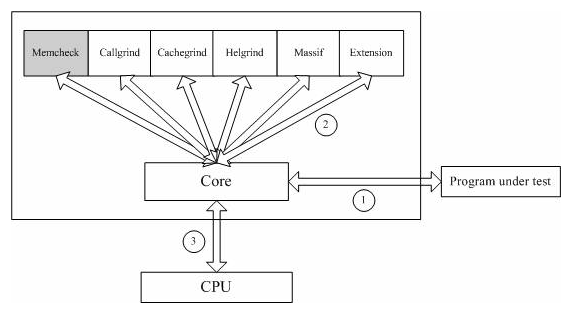
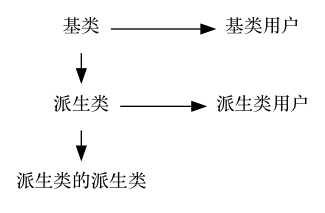

## 2.valgrind

### 2.1 框架

  

## 3.访问控制说明符
1. **类的成员的访问控制说明符**用于控制**类的使用者**对类中成员的访问权限
2. **派生列表中的访问控制说明符**用于控制**派生类的使用者**对**派生类从基类继承的成员**的访问权限

## 4.static函数与普通函数的区别
* static函数与普通函数作用域不同，仅在本文件。只在当前源文件中使用的函数应该说明为内部函数（static修饰的函数），
内部函数应该在当前源文件中说明和定义。对于可在当前源文件以外使用的函数，应该在一个头文件中说明，要使用这些函数的源文件要包含这个头文件
* static函数在内存中只有一份，普通函数在每个被调用中维护一份拷贝