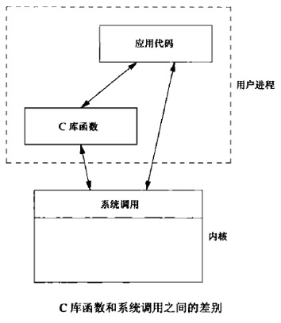
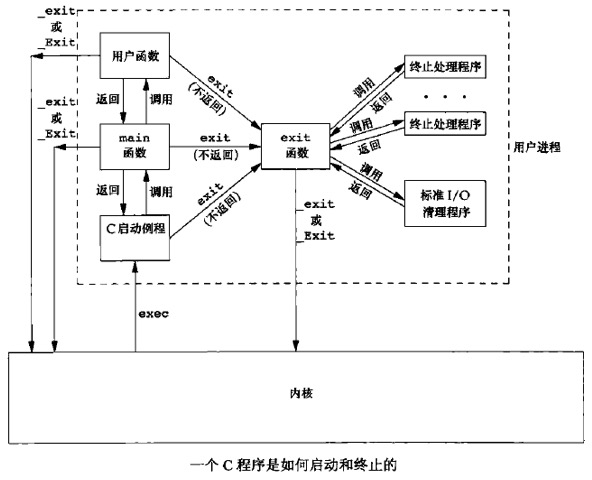
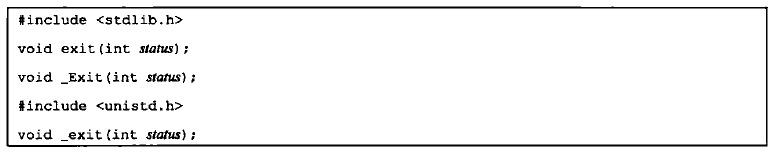
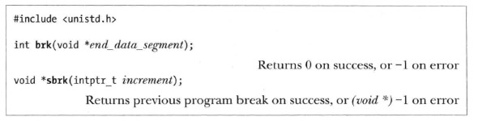
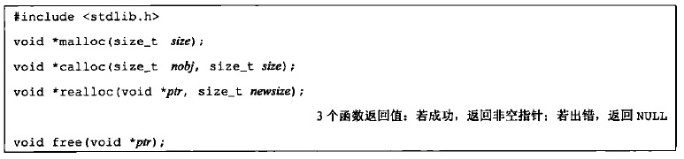
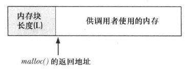
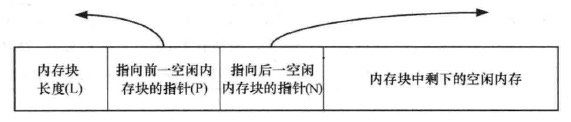
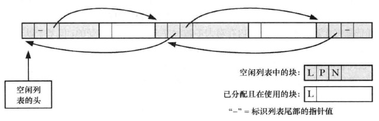

|**I/O**|**文件系统**|**进程**|**线程**|**进程间通信**|
|:--:|:--:|:--:|:--:|:--:|
|[一.文件I/O](#ch1)<br>[三.标准I/O库](#ch3)<br>[八.高级I/O](#ch8)|[二.文件和目录](#ch2)|[四.进程环境](#ch4)<br>[五.进程控制](#ch5)|[六.线程](#ch6)<br>[七.线程控制](#ch7)|[九.进程间通信](#ch9)<br>[十.信号](../interview/temp/信号.md)|

<br>
<br>

<div align="center">  </div>

<br>
<br>

<h2 id="ch1"></h2>

* [一.文件I/O](#一文件io)
    - [1.文件描述符](#1文件描述符)
    - [2.相关调用](#2相关调用)
        + [2.1 打开文件](#21-打开文件)
        + [2.2 创建文件](#22-创建文件)
        + [2.3 关闭文件](#23-关闭文件)
        + [2.4 定位读写位置](#24-定位读写位置)
        + [2.5 文件读](#25-文件读)
        + [2.6 文件写](#26-文件写)
        + [2.7 fcntl函数](#27-fcntl函数)
    - [3.进程间文件共享](#3进程间文件共享)
    - [4.原子操作](#4原子操作)
    - [5.数据同步](#5数据同步)

<h2 id="ch2"></h2>

* [二.文件和目录](#二文件和目录)
    - 前言：[文件系统](#文件系统)
    - [1.获取文件信息](#1获取文件信息)（stat、fstat、lstat、fstatat）
    - [2.文件类型](#2文件类型)
    - [3.用户ID和组ID](#3用户id和组id)
        + [3.1 进程与文件的用户ID及组ID](#31-进程与文件的用户id及组id)
        + [3.2 修改文件的所有者和组所有者](#32-修改文件的所有者和组所有者)（chown、fchown、fchownat、lchown）
    - [4.文件访问权限](#4文件访问权限)
        + [4.1 进程的文件访问权限](#41-进程的文件访问权限)（access、faccessat）
        + [4.2 新文件的文件访问权限](#42-新文件的文件访问权限)（umask）
        + [4.3 修改文件访问权限](#43-修改文件访问权限)（chmod、fchmod、fchmodat）
    - [5.新文件和目录的所有权](#5新文件和目录的所有权)
    - [6.粘着位](#6粘着位)
    - [7.文件长度](#7文件长度)
        + [7.1 文件中的空洞](#71-文件中的空洞)
        + [7.2 文件截断](#72-文件截断)（truncate、ftruncate）
    - [8.硬链接](#8硬链接)
        + [8.1 创建硬链接](#81-创建硬链接)（link、linkat）
        + [8.2 删除硬链接](#82-删除硬链接)（unlink、unlinkat）
    - [9.符号链接](#9符号链接)
        + [9.1 创建符号链接](#91-创建符号链接)（symlink、symlinkat）
        + [9.2 读取符号链接](#92-读取符号链接)（readlink、readlinkat）
    - [10.目录](#10目录)
        + [10.1 创建目录](#101-创建目录)（mkdir、mkdirat）
        + [10.2 删除目录](#102-删除目录)（rmdir）
        + [10.3 读目录](#103-读目录)（opendir、fdopendir、readdir、rewinddir、closedir、telldir、seekdir）
        + [10.4 更改当前目录](#104-更改当前目录)（chdir、fchdir）
        + [10.5 获取当前目录的绝对路径](#105-获取当前目录的绝对路径)（getcwd）
    - [11.重命名](#11重命名)（rename、renameat）
    - [12.文件的时间](#12文件的时间)
        + [12.1 更改文件的访问和修改时间](#121-更改文件的访问和修改时间)（futimens、utimensat、utimes）
    - [13.设备特殊文件](#13设备特殊文件)

<h2 id="ch3"></h2>

* [三.标准I/O库](#三标准io库)
    - [1.流](#1流)
        + [1.1 流的定向](#11-流的定向)（fwide）
        + [1.2 3个标准流](#12-3个标准流)
    - [2.FILE对象](#2file对象)
    - [3.缓冲](#3缓冲)
        + [3.1 3种缓冲类型](#31-3种缓冲类型)（setbuf、setvbuf）
        + [3.2 缓冲区冲洗](#32-缓冲区冲洗)（fflush）
        + [3.3 标准流与缓冲](#33-标准流与缓冲)
    - [4.相关调用](#4相关调用)
        + [4.1 打开流](#41-打开流)（fopen、freopen、fdopen）
        + [4.2 关闭流](#42-关闭流)
        + [4.3 读写流](#43-读写流)
        + [4.4 定位流](#44-定位流)
        + [4.5 格式化I/O](#45-格式化io)
        + [4.6 获取流相应的文件描述符](#46-获取流相应的文件描述符)
        + [4.7 创建临时文件](#47-创建临时文件)
    - [5.内存流](#5内存流)

<h2 id="ch4"></h2>

* [四.进程环境](#四进程环境)
    - [1.进程的启动与终止](#1进程的启动与终止)
        + [1.1 main函数](#11-main函数)
        + [1.2 进程终止的方式](#12-进程终止的方式)
        + [1.3 终止函数](#13-终止函数)
        + [1.4 终止状态](#14-终止状态)
        + [1.5 登记终止处理程序](#15-登记终止处理程序)
    - [2.环境表](#2环境表)
        + [2.1 获取环境变量](#21-获取环境变量)
        + [2.2 修改环境变量](#22-修改环境变量)
    - [3.C程序的存储空间布局](#3c程序的存储空间布局)
    - [4.共享库](#4共享库)
    - [5.进程堆空间的管理](#5进程堆空间的管理)
    - [6.进程资源限制](#6进程资源限制)
    - [7.Core Dump](#7core-dump)（外加）
        + [7.1 Core Dump的概念及用途](#71-core-dump的概念及用途)
        + [7.2 产生Core Dump](#72-产生core-dump)
        + [7.3 调试Core Dump](#73-调试core-dump)

<h2 id="ch5"></h2>

* [五.进程控制](#五进程控制)
    - [1.进程标识](#1进程标识)
        + [1.1 2个特殊进程](#11-2个特殊进程)
        + [1.2 进程相关的ID获取函数](#12-进程相关的id获取函数)
    - [2.进程的创建](#2进程的创建)
        + [2.1 fork](#21-fork)
        + [2.2 vfork](#22-vfork)
    - [3.进程的终止](#3进程的终止)
        + [3.1 子进程向父进程传递状态](#31-子进程向父进程传递状态)
        + [3.2 父子进程以不同顺序终止](#32-父子进程以不同顺序终止)
    - [4.竞争条件](#4竞争条件)
    - [5.exec函数](#5exec函数)
    - [6.更改用户ID和更改组ID](#6更改用户id和更改组id)
    - [7.system函数](#7system函数)
    - [8.用户标识](#8用户标识)
    - [9.进程调度](#9进程调度)
    - [10.进程时间](#10进程时间)

<h2 id="ch6"></h2>

* [六.线程](#六线程)
    - [1.相关函数](#1相关函数)
        + [pthread_create函数](#1pthread_create函数)
        + [pthread_join函数](#2pthread_join函数)
        + [pthread_self函数](#3pthread_self函数)
        + [pthread_detach函数](#4pthread_detach函数)
        + [pthread_exit函数](#5pthread_exit函数)
        + [pthread_equal函数](#6pthread_equal函数)
        + [pthread_cancel函数](#7pthread_cancel函数)
        + [pthread_cleanup_push和pthread_cleanup_pop函数](#8pthread_cleanup_push和pthread_cleanup_pop函数)
    - [2.线程同步](#2线程同步)
        + [2.1 互斥锁](#21-互斥锁)
        + [2.2 读写锁](#22-读写锁)
        + [2.3 条件变量](#23-条件变量)
        + [2.4 自旋锁](#24-自旋锁)
        + [2.5 屏障](#25-屏障)

<h2 id="ch7"></h2>

* [七.线程控制](#七线程控制)
    - [1.线程限制](#1线程限制)
    - [2.线程属性](#2线程属性)
        + [2.1 线程属性](#21-线程属性)
        + [2.2 取消选项](#22-取消选项)
    - [3.同步属性](#3同步属性)
        + [3.1 互斥锁属性](#31-互斥锁属性)
        + [3.2 读写锁属性](#32-读写锁属性)
        + [3.3 条件变量属性](#33-条件变量属性)
        + [3.4 屏障属性](#34-屏障属性)
    - [4.线程特定数据](#4线程特定数据)
        + [pthread_once和pthread_key_create函数](#1pthread_once和pthread_key_create函数)
        + [pthread_getspecific和pthread_setspecific函数](#2pthread_getspecific和pthread_setspecific函数)
        + [pthread_key_delete函数](#3pthread_key_delete函数)
    - [5.线程和信号](#5线程和信号)
        + [5.1 阻止信号发送](#51-阻止信号发送)
        + [5.2 等待信号](#52-等待信号)
    - [6.线程和fork](#6线程和fork)
    - [7.线程和I/O](#7线程和io)

<h2 id="ch8"></h2>

* [八.高级I/O](#八高级io)
    - [1.非阻塞I/O]()
    - [2.记录锁](#2记录锁)
    - [3.I/O复用]()
    - [4.异步I/O](#4异步io)
            + [4.1 AIO控制块](#41-aio控制块)
            + [4.2 异步读与异步写](#42-异步读与异步写)
            + [4.3 获取异步I/O的状态](#43-获取异步io的状态)
            + [4.4 获取异步I/O返回值](#44-获取异步io返回值)
            + [4.5 阻塞进程到异步I/O完成](#45-阻塞进程到异步io完成)
            + [4.6 取消异步I/O](#46-取消异步io)
            + [4.7 批量提交异步I/O请求](#47-批量提交异步io请求)
            + [4.8 异步I/O的数量限制](#48-异步io的数量限制)
        - [5.readv与writev]()
        - [6.存储映射I/O](#6存储映射io)
                + [6.1 mmap建立映射](#61-mmap建立映射)
                + [6.2 mprotect修改映射区权限](#62-mprotect修改映射区权限)
                + [6.3 msync冲洗映射区](#63-msync冲洗映射区)
                + [6.4 munmap解除映射](#64-munmap解除映射)

<h2 id="ch9"></h2>

* [九.进程间通信](#十进程间通信)
    - [1.管道](#1管道)
        + [1.1 创建管道](#11-创建管道)
        + [1.2 管道的读写规则](#12-管道的读写规则)
        + [1.3 标准I/O库管道函数](#13-标准io库管道函数)
    - [2.协同进程](#2协同进程)
    - [3.FIFO](#3fifo)
        + [3.1 创建FIFO](#31-创建fifo)
        + [3.2 打开FIFO](#32-打开fifo)
        + [3.3 读写FIFO](#33-读写fifo)
    - [4.XSI IPC](#4xsi-ipc)
        + [5.消息队列](#5消息队列)
            * [5.1 与消息队列相关的结构](#51-与消息队列相关的结构)
            * [5.2 创建或打开消息队列](#52-创建或打开消息队列)
            * [5.3 操作消息队列](#53-操作消息队列)
            * [5.4 添加消息](#54-添加消息)
            * [5.5 获取消息](#55-获取消息)
        + [6.信号量](#6信号量)
            * [6.1 信号量的相关结构](#61-信号量的相关结构)
            * [6.2 获得信号量](#62-获得信号量)
            * [6.3 操作信号量](#63-操作信号量)
        + [7.共享存储](#7共享存储)
            * [7.1 共享存储的内核结构](#71-共享存储的内核结构)
            * [7.2 创建或获得共享存储](#72-创建或获得共享存储)
            * [7.3 操作共享存储](#73-操作共享存储)
            * [7.4 与共享存储段连接](#74-与共享存储段连接)
            * [7.5 与共享存储段分离](#75-与共享存储段分离)
    - [8.POSIX信号量](#8posix信号量)
        + [8.1 创建或获取命名信号量](#81-创建或获取命名信号量)
        + [8.2 关闭释放信号量](#82-关闭释放信号量)
        + [8.3 销毁命名信号量](#83-销毁命名信号量)
        + [8.4 调节信号量的值](#84-调节信号量的值)
        + [8.5 创建未命名信号量](#85-创建未命名信号量)
        + [8.6 销毁未命名信号量](#86-销毁未命名信号量)
        + [8.7 检索未命名信号量的值](#87-检索未命名信号量的值)

<br>
<br>
<br>
<br>


# 四.进程环境

## 1.进程的启动与终止

<div align="center">  </div>

### 1.1 main函数

C程序总是从`main`函数开始执行的。`main`函数的原型是：

```
int main(int argc,char* argv[]);
```

* 参数：
    * `argc`:命令行参数的数目（ISO C和POSIX.1都要求argv\[argc\]是一个空指针）
    * `argv`：由指向各命令行参数的指针所组成的数组。`ISOC`和`POSIX`都要求`argv[argc]`是一个空指针

```
#include <stdio.h>
#include <stdlib.h>

int main(int argc,char* argv[])
{
    printf("%d parameters: \n",argc);
    for(int i = 0;i < argc;i++){     //argv[argc]为NULL
        printf("  %s\n",argv[i]);
    }
    return 0;
}
```

上面的程序可以打印调用程序时的参数：

```
./a.out hello ' ' world
4 parameters:
  ./a.out
  hello

  world
```

当内核通过`exec`函数执行 C 程序、在调用`main`之前先调用一个特殊的启动例程

* 可执行程序文件将此启动例程指定为程序的起始地址（这是由链接器设置的，而链接器由C编译器调用）
* 启动例程从内核取得命令行参数和环境变量值，为调用`main`函数做好安排

启动例程使得从main返回后立即调用exit函数。如果将启动例程以C代码形式表示（实际上该例程常常以汇编语言编写），则它调用main函数的形式可能是：

```c
exit(main(argc,argv));
```

### 1.2 进程终止的方式

有 8 种方式使得进程终止，其中 5 种为正常终止，3 种异常终止：

- **正常终止方式**：
    - 从`main`函数返回
    - 调用`exit`函数
    - 调用`_exit`函数或者`_Exit`函数
    - 多线程的程序中，最后一个线程从其启动例程返回
    - 多线程的程序中，从最后一个线程调用`pthread_exit`函数
- **异常终止方式**：
    - 调用`abort`函数
    - 接收到一个信号
    - 多线程的程序中，最后一个线程对取消请求作出响应

### 1.3 终止函数

下列3个函数正常终止一个程序

<div align="center">  </div>

* 参数：
    * `status`：终止状态

三个终止函数的区别：

- `_exit`和`_Exit`函数：立即进入内核
- `exit`函数：先执行一些清理处理，然后进入内核

> `exit`和`_Exit`是由 ISO C 说明的， `_exit`是由 POSIX 说明的 ，因此头文件不同


## 5.进程堆空间的管理

> 堆上空间分配和释放核心都是通过调整**program break**来实现的，malloc和free维护空闲空间链表，以减少调整**program break**的系统调用的调用次数

### 1）调整program break来分配与释放

可以通过**brk**函数和**sbrk**函数改变进程的**program break**位置，从而分配或释放内存。**program break**与[进程的内存布局结构](#3c程序的存储空间布局)中`&end`位置相同

**program break的位置抬升后，程序可以访问新分配区域内的任何内存地址，而此时物理内存页尚未分配。内核会在进程首次试图访问这些虚拟内存地址时自动分配新的物理内存页**

<div align="center">  </div>

* **brk**：将**program break**设置为参数指定的位置
    - 虚拟内存以页为单位进行分配，所以`end_data_segment`实际会四舍五入到下一个内存页的边界处
    - 当试图将`end_data_segment`设置为一个**低于**其初始值（&end）的位置时，可能导致无法预知的行为
* **sbrk**：将**program break**在原有地址上增加参数`increment`大小（`intptr_t`为整形类型），该函数成功时返回前一**program break**的地址

> **sbrk(0)**将返回**program break**的当前位置，可以用于跟踪堆的大小，或是监视内存分配函数的行为

### 2）使用C库函数进行分配释放

malloc相比brk和sbrk，具有以下优点：

* 属于C标准的一部分
* 更易于在多线程程序中使用
* 接口简单，允许分配小块内存
* 允许随意释放内存块，它们被维护于一张空闲内存列表内，在后续分配内存时循环使用

<div align="center">  </div>

* `malloc`: 分配指定字节数的存储区。存储区中的初始值不确定
    - malloc返回内存所采用的字节对齐方式，总是适宜于高效访问任何类型的C语言数据结构。在大多数架构上，意味着malloc是基于8字节或16字节边界来分配内存的
    - malloc(0)要么返回NULL，要么是一块可（并且应该）被free释放的内存
* `calloc` ：为指定数量指定长度的对象分配存储空间。空间中的每一位都初始化为0
* `realloc` ：增加或减少以前分配区的长度
    - 当增加长度时，可能需将以前分配区的内容移到另外一个足够大的区域，以便在尾端提供增加的存储区，而新增区域内的初始值则不确定
    - 函数调用前后可能是不同的存储区，所以调用前不应该有指针指向这段存储区，不然修改后，可能该指针会非法访问
    - 应该使用另一个指针保存`realloc`的返回值，因为如果使用传入的实参保存返回值，那么一旦`realloc`失败，则会传回NULL，原来的动态内存区再也无法访问，从而发生内存泄露
* `free`:上述3个函数都需通过free释放。一般情况下，free并不降低**program break**的位置，而是将这块内存增加到空闲内存列表中，供后续的malloc循环使用，原因是：
    - 被释放的内存块通常会位于堆的中间，而非堆的顶部，因为降低**program break**是不可能的
    - 它最大限度地减少了程序必须执行的`sbrk`调用次数
    - 在大多数情况下，降低**program break**不会对那些分配大量内存的程序有多少帮助，因为它们通常倾向于持有已分配内存或是反复释放和重新分配内存，而非释放所有内存后再持续运行一段时间

**这些分配例程通常用`sbrk`系统调用实现**

* `sbrk`可以扩充或缩小进程的存储空间。但是大多数malloc和free的实现都不减小进程的存储空间：释放的空间可供以后再分配，将它们保持在malloc池中而不返回给内核
* 大多数实现所分配的存储空间要比所要求的稍大一些，额外的空间用来记录管理信息，比如分配块的长度、指向下一个分配块的指针等等（如果在一个动态分配区的尾部之后或者在起始位置之前进行写操作，会修改管理记录信息。这种类型的错误是灾难性的，但是由于这种错误不会立即暴露出来，因此很难被发现）
* `malloc`和`free`相关的致命性错误
    - 调用了`malloc`函数但是没有调用`free`函数：会发生内存泄漏，该进程占用的存储空间就会连续增加，直到不再有空闲空间。此时过度的换页开销会导致性能下降
    - free一个已经释放了的块
    - 调用free时所用的指针不是3个alloc函数的返回值

### 3）malloc和free的实现

**malloc的实现**

1. 首先会扫描（不同实现扫描策略可能不同）之前由free释放的空闲内存块列表，试图找到尺寸大小**大于或等于**要求的一块空闲内存
    * 如果一内存块尺寸恰好符合要求，那么直接返回给调用者
    * 如果内存块较大，那么进行分割，将一块大小相当的内存返回给调用者，剩余内存块保留在空闲列表
2.

<div align="center">  </div>

**free的实现**

<div align="center">  </div>


<div align="center">  </div>

>

<br>


